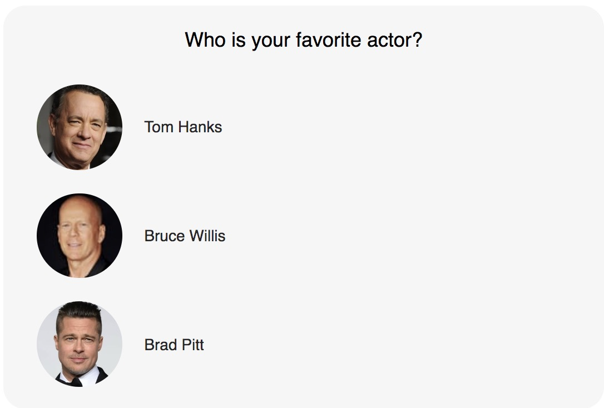

# Pollsr

 [](https://travis-ci.com/yoriiis/pollsr) [](https://coveralls.io/github/yoriiis/pollsr?branch=master)  [](https://bundlephobia.com/result?p=fela@latest)

Pollsr is a **minimalist** library to dynamically create polls with a elegante default theme.

Instanciate on the fly with lazyload, dynamic import or intersection observer for more flexibility and better UX performance.

<p align="center">
    <a href="https://yoriiis.github.io/pollsr" title="Pollsr demo">
        
    </a>
</p>

## Installation

The plugin is available as the `pollsr` package name on [npm](https://www.npmjs.com/package/pollsr).

```bash
npm i --save-dev pollsr
```

```bash
yarn add --dev pollsr
```

## Demo

Online demo is available on [yoriiis.github.io/pollsr](https://yoriiis.github.io/pollsr).

The project includes also several examples of Pollsr implementation.

## JSON structure

The Pollsr project includes a minimalist JSON example in the folder `./examples/datas.json`.

In case of JSON fields updates, use the `PollsrTemplate` and update `getTemplate` and `getAnswersList` function according to your needs.

```json
{
    "id": "",
    "question": "",
    "answers": [
        {
            "id": "",
            "title": "",
            "image": ""
        }
    ]
}
```

## Basic usage

Instanciate the Pollsr element like the following example.

> The `hasVoted` parameter must be set at initialize to reflect if the user has already voted. On vote action, the parameter is automatically updated.
>
> The `onAction` parameter allows to call a function on the vote action, for example save the data with a http request, in the browser storage or what you want.

```html
<div id="pollsr-1"></div>
```

```javascript
import { PollsrCore } from "pollsr";
import datas from "datas.json";

const pollsrCore = new PollsrCore({
    element: document.querySelector("#pollsr-1"),
    datas: datas,
    hasVoted: false,
    onAction: answerId => {
        // Put here the action on answer click event (post, fetch, localStorage, etc.)
    }
});
```

### Options

You can pass configuration options to `PollsrCore`. Example below show all default values.

```javascript
{
    element: null,
    template: null,
    datas: null,
    hasVoted: false,
    onAction: null
}
```

* `element` - {HTMLElement} - DOM element reference
* `template` - {Class} - Override the default template
* `datas` - {Object} - JSON datas for the Pollsr
* `onAction` - {Function} - Function executes on answer click
* `hasVoted` - {Boolean} - Is the answer already voted?

## Using a custom template

Custom template allows to override default behaviors with a custom class which extends `PollsrTemplate`. Please, respect the naming of the `PollsrTemplate` methods to overrides them.

Create a new file `custom-pollsr-template.js` for the custom template. Example below override the default template. The `super` keyword (optional) allow to keep the default behavior and add somes code.

```javascript
import { PollsrTemplate } from "pollsr";

class CustomTemplate extends PollsrTemplate {

    updateTemplateAfterVote() {
        super.updateTemplateAfterVote();

        this.options.element
            .querySelector(`.pollsr-button[data-answer-id="${answerId}"]`)
            .parentNode.classList.add("active");
    }

    getTemplate(datas) {
        return `<div class="pollsr${this.options.hasVoted ? " has-voted" : ""}">
                    <p class="pollsr-question">Hey, ${datas.question}</p>
                    <ul class="pollsr-answers">
                        ${this.getAnswersList(datas.answers)}
                    </ul>
                    <a href="https://www.themoviedb.org" class="pollsr-footer">Source: TMDb</a>
                </div>`;
    }
}
```

Next step, import `custom-pollsr-template.js` file and use it as parameter `template` of `PollsrCore` class.

```javascript
import { PollsrCore } from "pollsr";
import CustomTemplate from "./custom-pollsr-template.js";
import datas from "datas.json";

let pollsrCore = new PollsrCore({
    element: document.querySelector("#poll-4490"),
    datas: datas,
    template: new CustomTemplate()
});

pollsrCore.create();
```

## Available methods

Each pollsr instanciation return the instance of the class with somes available methods to easily manipulate the poll.

### Destroy

The `destroy()` function automatically destroy `pollsrCore` and `pollsrTemplate` instances.

```javascript
pollsrCore.destroy();
```

## Licence

Pollsr and his documentation are licensed under the [MIT License](http://opensource.org/licenses/MIT).

Created with ♥ by [@yoriiis](http://github.com/yoriiis).
